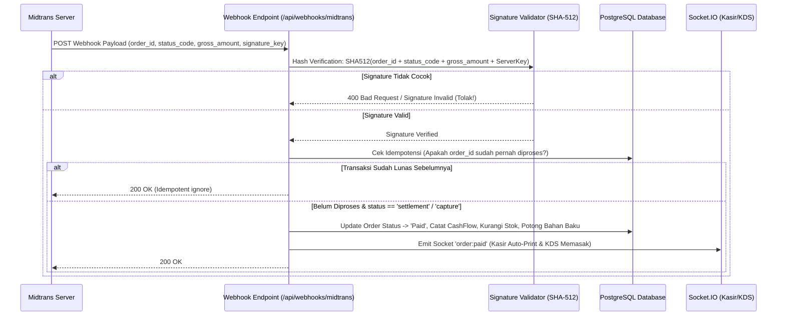

# Optional Midtrans Payment Gateway Architecture & Technical Specification

## 1. Arsitektur Dual-Level Midtrans (Platform SaaS & Tenant POS)

Sistem pembayaran Midtrans dirancang **modular & 100% opsional** pada 2 level yang berbeda:

```
                            SISTEM PEMBAYARAN MIDTRANS
                                        |
             +--------------------------+--------------------------+
             |                                                     |
    [ LEVEL 1: SAAS BILLING ]                             [ LEVEL 2: TENANT POS ]
  (Tenant bayar langganan ke Codenusa)                  (Pelanggan bayar pesanan ke Tenant)
             |                                                     |
  - Mode A: Midtrans Gateway (Codenusa)                 - Mode A: Manual / Offline (Kasir, Tunai, QRIS Statis)
    (QRIS, VA BCA/Mandiri/BRI, CC)                      - Mode B: Midtrans Tenant (BYOK - Server Key Sendiri)
  - Mode B: Transfer Manual / Invoice                   - Mode C: Midtrans Aggregator (Split Settlement Codenusa)
```

---

## 2. Level 1: SaaS Subscription Billing (Pembayaran Langganan Tenant)

Digunakan saat tenant mendaftar atau memperpanjang paket langganan SaaS (Starter, Growth, Business, Add-ons).

### Pilihan Metode Pembayaran bagi Tenant:
1. **Midtrans Snap / Core API (Otomatis)**:
   - Tenant memilih paket -> Sistem menghasilkan Snap Token / Snap Popup -> Tenant bayar via QRIS / VA / E-Wallet.
   - Webhook Midtrans masuk -> Sistem otomatis memverifikasi signature -> Status langganan tenant langsung aktif (`ACTIVE`) detik itu juga.
2. **Transfer Bank Manual (Opsional)**:
   - Tenant mengunduh Invoice PDF -> Transfer ke rekening bank Codenusa -> Unggah bukti bayar -> Platform Admin memvalidasi dan mengaktifkan tenant.

---

## 3. Level 2: Tenant POS & Order Billing (Pembayaran Pesanan Pelanggan di Toko)

Setiap tenant bebas memilih apakah ingin mengaktifkan Midtrans di kasir/meja atau tetap menggunakan metode kasir konvensional.

### Mode Pembayaran di Kasir/Outlet:
1. **Mode Default: Kasir Offline & QRIS Statis (Tanpa Biaya Gateway)**:
   - Tunai (Cash).
   - QRIS Statis (foto cetak barcode QRIS toko yang sudah ada).
   - Mesin EDC / Debit Card.
   - Kasir mengklik tombol "Lunas" secara manual.
2. **Mode Midtrans Integrasi (Opsional - Diaktifkan di Pengaturan Toko)**:
   - **Bring Your Own Keys (BYOK)**:
     - Tenant mendaftar akun Midtrans Merchant sendiri.
     - Tenant memasukkan `Server Key` dan `Client Key` Midtrans di menu **Pengaturan Pembayaran**.
     - Uang transaksi pelanggan langsung masuk 100% ke rekening Midtrans milik tenant tanpa potongan Codenusa.
   - **Fitur Kasir & Meja (Dine-In QR Order)**:
     - Kasir memilih "Dynamic QRIS Midtrans" -> Layar kasir atau tablet pelanggan memunculkan QRIS dinamis unik.
     - Pelanggan scan & bayar -> Webhook Midtrans otomatis mendeteksi lunas -> Pesanan otomatis berubah status `Paid`, struk auto-print, status KDS otomatis masuk dapur.

---

## 4. Desain Abstraksi Teknis (Payment Gateway Interface)

Untuk menjaga kode tetap bersih, aman, dan tidak terikat kaku hanya pada satu vendor, digunakan pola **Adapter / Strategy Pattern**:

```typescript
// IPaymentProvider.ts
export interface CreatePaymentPayload {
  tenantId: string;
  orderId: string;
  grossAmount: number;
  customerDetails: {
    name: string;
    email?: string;
    phone?: string;
  };
  itemDetails: Array<{
    id: string;
    name: string;
    price: number;
    quantity: number;
  }>;
}

export interface PaymentResult {
  transactionId: string;
  paymentType: string;
  redirectUrl?: string;
  token?: string; // Midtrans Snap Token
  qrCodeUrl?: string;
  vaNumber?: string;
  status: 'PENDING' | 'SETTLEMENT' | 'DENY' | 'EXPIRE' | 'CANCEL';
}

export interface IPaymentProvider {
  createTransaction(payload: CreatePaymentPayload): Promise<PaymentResult>;
  verifyWebhook(payload: any, signatureHeader?: string): Promise<{
    isValid: boolean;
    orderId: string;
    transactionStatus: string;
    fraudStatus?: string;
    paymentType: string;
    grossAmount: number;
  }>;
  checkStatus(orderId: string): Promise<PaymentResult>;
  cancelTransaction(orderId: string): Promise<boolean>;
}
```

---

## 5. Alur Kerja Webhook & Verifikasi Keamanan (Zero-Trust)

Webhook Midtrans rentan terhadap pemalsuan jika tidak diverifikasi dengan ketat. Backend Codenusa menerapkan protokol keamanan standar perbankan:



### Rumus Verifikasi Signature Key Midtrans:
```typescript
import crypto from 'crypto';

export function verifyMidtransSignature(
  orderId: string,
  statusCode: string,
  grossAmount: string,
  serverKey: string,
  receivedSignature: string
): boolean {
  const payloadString = `${orderId}${statusCode}${grossAmount}${serverKey}`;
  const calculatedHash = crypto.createHash('sha512').update(payloadString).digest('hex');
  return calculatedHash === receivedSignature;
}
```

---

## 6. Desain Skema Database Tambahan

Untuk mendukung Midtrans secara opsional per tenant:

```prisma
// ─── Konfigurasi Payment Gateway Tenant ──────────────────────────────
model TenantPaymentConfig {
  id               String   @id @default(uuid())
  tenantId         String   @unique
  tenant           Tenant   @relation(fields: [tenantId], references: [id], onDelete: Cascade)
  
  // Midtrans Settings
  isMidtransEnabled Boolean @default(false)
  midtransMode     String   @default("SANDBOX") // SANDBOX atau PRODUCTION
  serverKey        String?  // Terenkripsi AES-256 di DB
  clientKey        String?  // Client key untuk Snap.js frontend
  merchantId       String?
  
  // Metode Aktif yang diizinkan
  enableQRIS       Boolean  @default(true)
  enableVA         Boolean  @default(false)
  enableGoPay      Boolean  @default(true)
  enableShopeePay  Boolean  @default(false)
  
  createdAt        DateTime @default(now())
  updatedAt        DateTime @updatedAt
}

// ─── Catatan Riwayat Transaksi Payment Gateway ────────────────────────
model PaymentTransaction {
  id                 String   @id @default(uuid())
  tenantId           String
  orderId            String?  // Tautan ke POS Order (jika Level 2)
  invoiceId          String?  // Tautan ke SaaS Subscription Invoice (jika Level 1)
  
  gateway            String   @default("MIDTRANS") // MIDTRANS, MANUAL_TRANSFER, CASH
  transactionId      String?  // ID dari Midtrans
  paymentType        String?  // qris, bank_transfer, gopay, cstore
  grossAmount        Float
  transactionStatus  String   // pending, settlement, expire, cancel, deny
  fraudStatus        String?  // accept, challenge, deny
  rawPayload         String?  // JSON stringified webhook payload untuk audit
  
  createdAt          DateTime @default(now())
  updatedAt          DateTime @updatedAt

  @@index([tenantId])
  @@index([orderId])
  @@index([invoiceId])
  @@index([transactionStatus])
}
```

---

## 7. Penanganan Enkripsi Rahasia Server Key (AES-256)
`Server Key` tenant disimpan secara terenkripsi menggunakan algoritma `AES-256-GCM` dengan Master Encryption Key dari Environment Variable (`APP_ENCRYPTION_KEY`). Server Key **tidak pernah ditampilkan** kembali ke frontend demi keamanan kredensial tenant.
