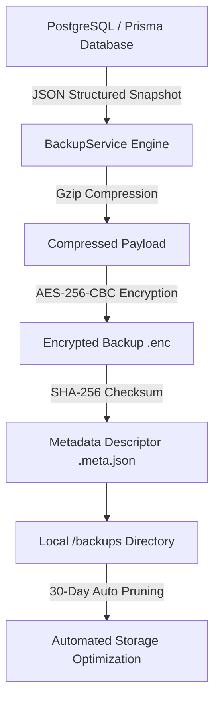

# Codenusa SaaS POS - Disaster Recovery & Business Continuity Runbook (DRP/BCP)

## 📌 1. Executive Summary & Recovery Objectives

| Metric | Target | Description |
| :--- | :--- | :--- |
| **RPO (Recovery Point Objective)** | **< 1 Jam** | Batas maksimal kehilangan data transaksi jika terjadi bencana total. Dijamin oleh snapshot otomatis berkala. |
| **RTO (Recovery Time Objective)** | **< 15 Menit** | Waktu maksimal yang dibutuhkan untuk memulihkan sistem hingga online kembali penuh. |
| **Enkripsi Data at Rest** | **AES-256-CBC** | Semua berkas backup dienkripsi dengan SHA-256 derived key sebelum disimpan ke disk. |
| **Integritas Berkas** | **SHA-256 Hash** | Metadata checksum diverifikasi sebelum proses dekripsi dan restorasi dijalankan. |
| **Kebijakan Retensi** | **30 Hari** | Berkas backup lama dipangkas otomatis untuk menjaga efisiensi penyimpanan server. |

---

## 🏗️ 2. Arsitektur Backup & Keamanan Data



### Format Penamaan Berkas
- **Full Platform Backup**: `backup-full-YYYY-MM-DDTHH-mm-ss-sssZ.json.gz.enc`
- **Tenant-Scoped Backup**: `backup-tenant-<tenantId>-YYYY-MM-DDTHH-mm-ss-sssZ.json.gz.enc`
- **Metadata Companion**: `<backup-file-name>.meta.json`

---

## 🛠️ 3. Standard Operating Procedures (SOP) Restore & Recovery

### Skenario 1: Bencana Total (Host VPS Down / Database Crash)
Jika server VPS mengalami kerusakan total atau database PostgreSQL corrupt:

1. **Siapkan Server Bersih**:
   ```bash
   cd /var/www/codepos/backend
   npm install
   npx prisma db push
   ```
2. **Ambil Berkas Backup Terakhir** dari offsite storage atau direktori `/var/www/codepos/backend/backups/`.
3. **Jalankan Restore Engine CLI**:
   ```bash
   # Masuk ke folder backend
   cd /var/www/codepos/backend
   
   # Jalankan perintah restore
   npx ts-node src/scripts/restore_database.ts --file=backup-full-2026-09-18T12-00-00.json.gz.enc
   ```
4. **Verifikasi Status Sistem via Health Check**:
   ```bash
   curl -s http://localhost:5000/api/health/deep | jq .
   ```
5. **Restart PM2 Service**:
   ```bash
   pm2 restart codepos-backend
   ```

---

### Skenario 2: Rollback Tenant Tunggal (Tenant Data Corruption / Accidental Deletion)
Jika salah satu tenant menghapus data menu atau pesanan secara tidak sengaja dan memerlukan rollback:

1. **Temukan Berkas Backup Tenant**:
   ```bash
   ls -la /var/www/codepos/backend/backups/ | grep tenant-
   ```
2. **Jalankan Pemulihan Khusus Tenant**:
   ```bash
   npx ts-node src/scripts/restore_database.ts --file=backup-tenant-tenant-default-muki-2026-09-18.json.gz.enc --tenant=tenant-default-muki
   ```
3. Data tenant lain di database PostgreSQL **tetap aman 100% dan tidak terganggu**.

---

## ⏱️ 4. Konfigurasi Crontab Otomatisasi Harian (VPS Production)

Tambahkan jadwal cron berikut pada user `root` atau `deploy` di VPS:

```bash
# Buka editor crontab
crontab -e

# Backup harian setiap pukul 03:00 WIB dini hari + Retensi 30 Hari
0 3 * * * cd /var/www/codepos/backend && /usr/bin/node dist/scripts/backup_database.js --purge --retention=30 >> /var/log/codepos-backup.log 2>&1
```

---

## 📊 5. Observabilitas & Endpoint Health Monitoring

Backend Codenusa menyediakan endpoint observability real-time untuk integrasi dengan Prometheus, Grafana, Datadog, atau Uptime Kuma:

| Endpoint | Method | Autentikasi | Kegunaan |
| :--- | :--- | :--- | :--- |
| `/api/health/ping` | `GET` | Publik | Fast liveness probe (Load Balancer & uptime monitor). |
| `/api/health/deep` | `GET` | Publik | Deep readiness telemetry (Database latency ms, RLS status, memory usage, storage, socket rooms). |
| `/api/health/backups` | `GET` | Admin/Owner | Menampilkan daftar seluruh backup beserta status enkripsi dan ukuran file. |
| `/api/health/backups/create` | `POST` | Admin/Owner | Memicu on-demand backup terenkripsi secara instan. |
| `/api/health/backups/purge` | `POST` | Admin/Owner | Memicu pembersihan retensi manual. |
| `/api/health/backups/restore` | `POST` | Superadmin | Melakukan restorasi data otomatis dari berkas snapshot. |

### Indikator Ambang Batas (Alerting Thresholds)
- **Database Latency**:
  - `< 100ms`: 🟢 Optimal
  - `100ms - 2000ms`: 🟡 Degraded
  - `> 2000ms` atau DB Error: 🔴 Critical (Status HTTP 503)
- **RAM Heap Utilization**:
  - `> 85%`: 🟡 Warning (Perlu Garbage Collection / Scale)
- **Storage / Uploads**:
  - `> 90% Kapasitas`: 🔴 Critical Alert
