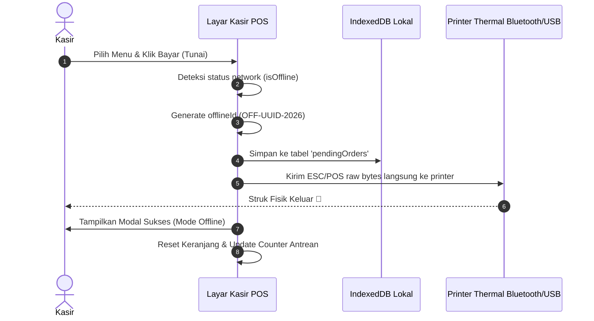
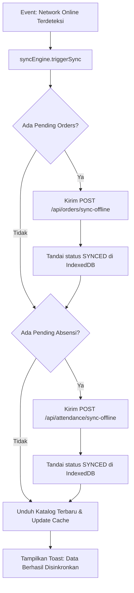

# Codenusa SaaS POS - Offline-First & APK Architecture Breakdown

Dokumen ini membedah secara mendalam setiap fase (**Phase 1 hingga Phase 7**) dari arsitektur **Offline-First POS & Android APK Readiness**, mencakup arsitektur teknis, struktur data, alur eksekusi, serta kriteria keberhasilan (*Definition of Done*).

---

## 📑 Daftar Isi Fase
1. [Phase 1: IndexedDB Local Storage & Caching Layer](#phase-1-indexeddb-local-storage--caching-layer)
2. [Phase 2: Reactive Network Health Monitor & UI Indicator](#phase-2-reactive-network-health-monitor--ui-indicator)
3. [Phase 3: POS Offline Checkout & Local Receipt Printing](#phase-3-pos-offline-checkout--local-receipt-printing)
4. [Phase 4: Staff PWA Offline Attendance & Canvas Compressor](#phase-4-staff-pwa-offline-attendance--canvas-compressor)
5. [Phase 5: Backend Idempotent Batch Sync Endpoints](#phase-5-backend-idempotent-batch-sync-endpoints)
6. [Phase 6: Sync Engine & Conflict Resolution Service](#phase-6-sync-engine--conflict-resolution-service)
7. [Phase 7: Android APK Packaging (Capacitor) & Tablet Kiosk Setup](#phase-7-android-apk-packaging-capacitor--tablet-kiosk-setup)

---

## Phase 1: IndexedDB Local Storage & Caching Layer

### 🎯 Tujuan
Membangun fondasi database lokal pada browser / Android WebView menggunakan `Dexie.js` yang terstruktur, cepat, dan aman dari pembersihan cache otomatis browser.

### 🛠️ Struktur Data IndexedDB (`frontend/src/db/offlineDb.ts`)
```typescript
import Dexie, { Table } from 'dexie';

export interface CachedProduct {
  id: number;
  name: string;
  price: number;
  cost: number;
  categoryId: number;
  categoryName?: string;
  barcode?: string;
  imageUrl?: string;
  trackStock: boolean;
  stock: number;
  variants?: any[];
  tenantId: string;
}

export interface CachedCategory {
  id: number;
  name: string;
  icon?: string;
  tenantId: string;
}

export interface CachedTable {
  id: number;
  tableNo: string;
  capacity: number;
  status: string;
  tenantId: string;
}

export interface CachedSetting {
  id: string; // 'current_settings'
  storeName: string;
  address?: string;
  phone?: string;
  receiptFooter?: string;
  taxPercentage: number;
  servicePercentage: number;
  qrisUrl?: string;
  tenantId: string;
}

export interface PendingOrder {
  id?: number; // auto-increment local key
  offlineId: string; // UUID v4 (e.g. "OFF-d9b8...-2026")
  orderNumber: string;
  tableId?: number;
  customerName?: string;
  customerPhone?: string;
  items: {
    productId: number;
    productName: string;
    quantity: number;
    price: number;
    notes?: string;
    selectedVariants?: any[];
  }[];
  subtotal: number;
  discount: number;
  tax: number;
  service: number;
  total: number;
  paymentMethod: 'CASH' | 'QRIS_MANUAL' | 'DEBIT' | 'TRANSFER';
  cashAmountPaid?: number;
  cashChange?: number;
  clientTimestamp: string; // ISO string
  syncStatus: 'PENDING' | 'SYNCING' | 'FAILED' | 'SYNCED';
  syncError?: string;
  retryCount: number;
  tenantId: string;
  outletId?: string;
  cashierId?: string;
  cashierName?: string;
}

export interface PendingAttendance {
  id?: number;
  offlineId: string;
  userId: string;
  userName: string;
  tenantId: string;
  type: 'IN' | 'OUT' | 'BREAK_IN' | 'BREAK_OUT';
  photoBase64: string; // Compressed JPEG
  latitude?: number;
  longitude?: number;
  notes?: string;
  clientTimestamp: string;
  syncStatus: 'PENDING' | 'SYNCING' | 'FAILED' | 'SYNCED';
  retryCount: number;
}

export interface SyncLog {
  id?: number;
  timestamp: string;
  type: 'ORDER_SYNC' | 'ATTENDANCE_SYNC' | 'CATALOG_DOWNLOAD';
  count: number;
  status: 'SUCCESS' | 'ERROR';
  details?: string;
}
```

### 📋 Checklist TODO Phase 1:
- [ ] 1.1 Install dependency: `npm install dexie` di direktori `frontend`.
- [ ] 1.2 Buat file `frontend/src/db/offlineDb.ts` dengan schema di atas dan helper method:
  - `saveCatalogToCache(products, categories, tables, settings)`
  - `getCachedCatalog()`
  - `queueOfflineOrder(orderPayload)`
  - `queueOfflineAttendance(attendancePayload)`
  - `getPendingOrders()`
  - `getPendingAttendances()`
  - `markOrderSynced(offlineId)`
  - `markAttendanceSynced(offlineId)`
- [ ] 1.3 Implementasikan auto-seeder saat user login atau POS dibuka: unduh katalog terbaru dari `/api/products`, `/api/categories`, `/api/tables`, `/api/settings` lalu simpan ke IndexedDB.

---

## Phase 2: Reactive Network Health Monitor & UI Indicator

### 🎯 Tujuan
Mendeteksi status koneksi internet secara real-time dan memberikan indikator visual yang elegan tanpa mengganggu alur kerja kasir.

### 🛠️ Alur & Logika (`useNetworkStatus.ts`)
1. **Event Listeners:** Mendengarkan event browser `window.addEventListener('online')` dan `window.addEventListener('offline')`.
2. **Heartbeat Poller:** Setiap 20 detik saat status `online`, lakukan fetch lightweight `HEAD /api/health` dengan timeout 3 detik. Jika timeout atau gagal, ubah status menjadi `OFFLINE` (mendeteksi hotspot/WiFi tanpa internet).
3. **Counter Watcher:** Menghitung jumlah record dengan status `PENDING` di `pendingOrders` dan `pendingAttendances`.

### 📋 Checklist TODO Phase 2:
- [ ] 2.1 Buat hook `frontend/src/hooks/useNetworkStatus.ts`.
- [ ] 2.2 Buat komponen `frontend/src/components/NetworkStatusBanner.tsx`:
  - **🟢 Status Online:** Menampilkan pill kecil hijau *"Cloud Aktif"*.
  - **🟡 Status Offline:** Menampilkan banner kuning dengan badge jumlah antrean *"Mode Offline (3 Transaksi Menunggu)"* + tombol *"Sync Sekarang"*.
  - **🔄 Status Syncing:** Animasi loading spinner *"Mengirim ke Server..."*.
- [ ] 2.3 Buat modal antrean `frontend/src/components/OfflineQueueModal.tsx` yang menampilkan daftar transaksi lokal di tablet dan tombol coba kirim ulang.
- [ ] 2.4 Pasang `NetworkStatusBanner` di layout utama ([`Layout.tsx`](file:///c:/ADATA/codepos/frontend/src/components/Layout.tsx)), POS Header, dan Staff PWA view.

---

## Phase 3: POS Offline Checkout & Local Receipt Printing

### 🎯 Tujuan
Memastikan kasir dapat memilih produk, memasukkan keranjang, menerapkan diskon, menghitung kembalian tunai, dan langsung mencetak struk thermal ke printer kasir saat offline.

### 🛠️ Alur Eksekusi POS Offline (`POSView.tsx`)


### 📋 Checklist TODO Phase 3:
- [ ] 3.1 Modifikasi `POSView.tsx`:
  - Tambahkan fallback pengambilan katalog: jika API gagal / network offline, ambil dari `offlineDb.cachedProducts`.
  - Pada fungsi `handleProcessPayment`:
    - Jika `!isOnline`, panggil `offlineDb.queueOfflineOrder(...)`.
    - Buat format nota offline (`OFF-XXXX`).
    - Panggil fungsi cetak struk thermal lokal.
    - Tampilkan notifikasi sukses: *"Transaksi berhasil dicatat lokal! Struk tercetak."*
- [ ] 3.2 Proteksi Metode Pembayaran:
  - Nonaktifkan tombol Midtrans QRIS Dinamis saat offline dengan badge *"Khusus Online"*.
  - Aktifkan opsi **Tunai**, **QRIS Statis Toko**, dan **Debit/Transfer Manual**.

---

## Phase 4: Staff PWA Offline Attendance & Canvas Compressor

### 🎯 Tujuan
Memungkinkan staf melakukan absensi selfie dan GPS secara offline tanpa file foto berukuran besar yang memberatkan tablet.

### 🛠️ Helper Kompresi Gambar (`imageCompressor.ts`)
```typescript
export async function compressSelfie(base64Str: string, maxWidth = 640, quality = 0.65): Promise<string> {
  return new Promise((resolve) => {
    const img = new Image();
    img.src = base64Str;
    img.onload = () => {
      const canvas = document.createElement('canvas');
      let width = img.width;
      let height = img.height;
      if (width > maxWidth) {
        height = Math.round((height * maxWidth) / width);
        width = maxWidth;
      }
      canvas.width = width;
      canvas.height = height;
      const ctx = canvas.getContext('2d');
      ctx?.drawImage(img, 0, 0, width, height);
      resolve(canvas.toDataURL('image/jpeg', quality));
    };
  });
}
```

### 📋 Checklist TODO Phase 4:
- [ ] 4.1 Buat utilitas kompresi `frontend/src/utils/imageCompressor.ts`.
- [ ] 4.2 Modifikasi `StaffPWAView.tsx`:
  - Saat menekan Clock-In / Clock-Out dalam kondisi offline:
    - Kompres foto kamera menjadi format JPEG <80KB.
    - Ambil koordinat GPS dari `navigator.geolocation.getCurrentPosition`.
    - Simpan ke `offlineDb.pendingAttendances` dengan `clientTimestamp`.
    - Tampilkan toast sukses: *"Absensi Anda tersimpan di perangkat dan akan terkirim otomatis saat online."*

---

## Phase 5: Backend Idempotent Batch Sync Endpoints

### 🎯 Tujuan
Menyediakan endpoint backend yang aman, menggunakan transaksi atomic database PostgreSQL, dan kebal terhadap duplikasi order (*idempotency*).

### 🛠️ Endpoint Spesifikasi Backend
1. **`POST /api/orders/sync-offline`**
   * **Payload:** `{ orders: PendingOrder[] }`
   * **Proses:**
     - Periksa setiap item dengan `offlineId`.
     - Gunakan `prisma.$transaction`:
       - Cek apakah order dengan `offlineId` sudah ada di tabel `Order`. Jika sudah, lewati (idempotent).
       - Insert order dengan `createdAt = order.clientTimestamp`.
       - Kurangi stok bahan baku / produk (jika stok < 0, log ke `InventoryAuditLog` tanpa membatalkan order).
       - Catat `Payment` dan `Cashflow`.
   * **Response:** `{ syncedCount: number, duplicatesSkipped: number, errors: [] }`

2. **`POST /api/attendance/sync-offline`**
   * **Payload:** `{ attendances: PendingAttendance[] }`
   * **Proses:**
     - Insert atau update baris `Attendance` dengan jam kehadiran aktual `clockIn = attendance.clientTimestamp`.
   * **Response:** `{ syncedCount: number }`

### 📋 Checklist TODO Phase 5:
- [ ] 5.1 Implementasikan endpoint `POST /api/orders/sync-offline` di [`backend/src/routes/orders.ts`](file:///c:/ADATA/codepos/backend/src/routes/orders.ts).
- [ ] 5.2 Implementasikan endpoint `POST /api/attendance/sync-offline` di [`backend/src/routes/attendance.ts`](file:///c:/ADATA/codepos/backend/src/routes/attendance.ts).
- [ ] 5.3 Validasi otentikasi JWT & scoping `tenantId` pada kedua endpoint.

---

## Phase 6: Sync Engine & Conflict Resolution Service

### 🎯 Tujuan
Engine otomatis di background yang mendeteksi pulihnya koneksi internet, mengunggah data yang tertunda, dan memperbarui status lokal.

### 🛠️ Alur Sinkronisasi (`syncEngine.ts`)


### 📋 Checklist TODO Phase 6:
- [ ] 6.1 Buat service `frontend/src/services/syncEngine.ts`.
- [ ] 6.2 Pasang trigger auto-sync pada `useNetworkStatus`: saat status berubah dari offline -> online, panggil `syncEngine.syncAll()`.
- [ ] 6.3 Buat tombol manual *"Sync Sekarang"* di modal antrean dan navbar header.
- [ ] 6.4 Catat riwayat proses sinkronisasi ke tabel `syncLogs` di IndexedDB.

---

## Phase 7: Android APK Packaging (Capacitor) & Tablet Setup

### 🎯 Tujuan
Membungkus aplikasi menjadi file APK Android mandiri sehingga kasir mendapatkan pengalaman aplikasi native yang kencang, layar penuh (*kiosk mode*), dan akses penuh ke hardware printer Bluetooth.

### 🛠️ Konfigurasi Capacitor
1. **File `capacitor.config.ts`**:
   ```typescript
   import { CapacitorConfig } from '@capacitor/cli';

   const config: CapacitorConfig = {
     appId: 'com.codenusa.poscafe',
     appName: 'Codenusa POS',
     webDir: 'dist',
     server: {
       androidScheme: 'https',
       cleartext: true
     },
     plugins: {
       SplashScreen: {
         launchShowDuration: 1500,
         backgroundColor: "#0f172a"
       }
     }
   };

   export default config;
   ```

2. **Panduan Build APK Lengkap:** Disimpan di `docs/apk-build-guide.md`.

### 📋 Checklist TODO Phase 7:
- [ ] 7.1 Tambahkan konfigurasi `capacitor.config.ts` di root project.
- [ ] 7.2 Tambahkan build scripts di `frontend/package.json`.
- [ ] 7.3 Buat panduan lengkap kompilasi APK (`docs/apk-build-guide.md`) mencakup instruksi Android Studio, Bluetooth permissions di `AndroidManifest.xml`, dan setup tablet kasir.

---

## 📊 Ringkasan Estimasi & Eksekusi

| Phase | Fokus Utama | Target File | Status |
| :--- | :--- | :--- | :--- |
| **Phase 1** | IndexedDB Storage & Schemas | `frontend/src/db/offlineDb.ts` | ⏳ Siap Dikerjakan |
| **Phase 2** | Network Monitor & Status Banner | `useNetworkStatus.ts`, `NetworkStatusBanner.tsx` | ⏳ Siap Dikerjakan |
| **Phase 3** | POS Offline Checkout & Local Receipt | `POSView.tsx`, `OfflineQueueModal.tsx` | ⏳ Siap Dikerjakan |
| **Phase 4** | Staff PWA Offline & Compressor | `imageCompressor.ts`, `StaffPWAView.tsx` | ⏳ Siap Dikerjakan |
| **Phase 5** | Backend Idempotent Sync Routes | `orders.ts`, `attendance.ts` | ⏳ Siap Dikerjakan |
| **Phase 6** | Auto Sync Engine & Background Worker | `syncEngine.ts` | ⏳ Siap Dikerjakan |
| **Phase 7** | Android APK Config & Guide | `capacitor.config.ts`, `apk-build-guide.md` | ⏳ Siap Dikerjakan |
