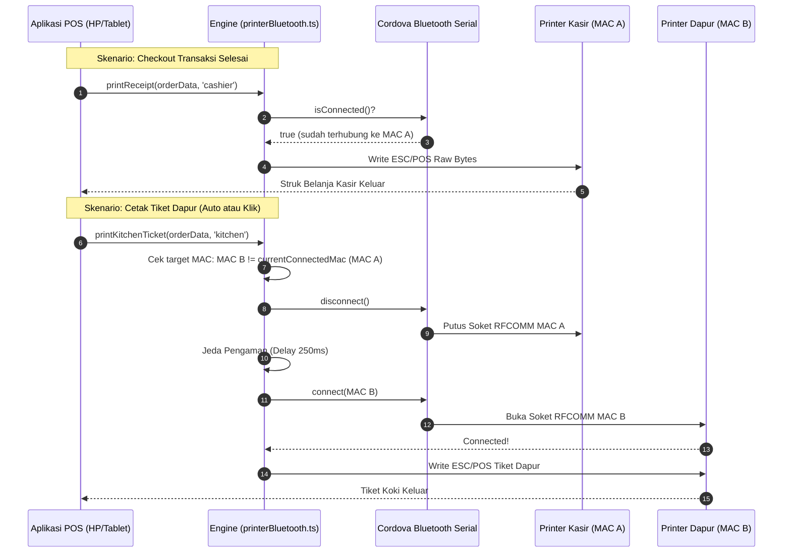
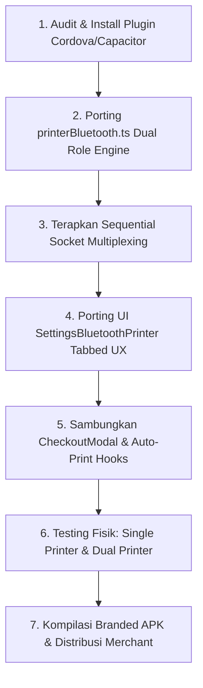

# Cetak Biru Arsitektur & Implementation Plan: Dual Bluetooth Printer (Kasir & Dapur)

Dokumen ini adalah **Standard Operating Procedure (SOP)**, spesifikasi teknis arsitektur, dan panduan implementasi menyeluruh mengenai sistem **Dual Bluetooth Thermal Printer (1 Printer Struk Kasir + 1 Printer Tiket Dapur)** dalam 1 perangkat HP/Tablet kasir Android maupun Web POS. 

Dokumen ini disusun dari awal sebagai referensi resmi yang siap direplikasi dan diterapkan pada seluruh proyek SaaS multi-tenant kita (Kafe, Resto, Retail, Bengkel, dan Laundry).

---

## 1. Latar Belakang & Analisis Masalah (Problem Statement)

### 1.1 Kebutuhan Lapangan
Pada operasional F&B (kafe, ramen shop, warung makan, cloud kitchen) dan unit bisnis retail/bengkel/laundry:
1. **Struk Kasir:** Diberikan kepada pelanggan sebagai bukti pembayaran resmi (memuat rincian harga, diskon, PPN, metode bayar, dan QRIS).
2. **Tiket Dapur (Koki / Barista):** Diserahkan ke bagian dapur untuk memproses pesanan (hanya memuat nama menu makanan/minuman, kuantiti, nomor meja, dan catatan khusus seperti *"tanpa daun bawang"* atau *"pedas level 3"*).

Seringkali kasir dan dapur berada di ruangan yang berdekatan atau dalam 1 area meja operasional, sehingga pemilik usaha lebih memilih menggunakan **2 unit printer termal Bluetooth nirkabel** daripada menarik kabel LAN/Ethernet atau jaringan Wi-Fi yang rentan konflik IP DHCP.

### 1.2 Hambatan Teknis (Technical Challenges)
1. **Keterbatasan Native Android Bluetooth Stack (SPP / RFCOMM):**
   Modul `cordova-plugin-bluetooth-serial` menggunakan profil Bluetooth Classic SPP (*Serial Port Profile*). Pada arsitektur OS Android, sebuah host Bluetooth umumnya hanya dapat mempertahankan **1 soket RFCOMM aktif** pada satu waktu ke sebuah perangkat printer serial. Jika aplikasi mencoba menulis secara paralel ke 2 printer tanpa manajemen antrean soket, koneksi akan terkunci (*socket collision / broken pipe*).
2. **Keterbatasan Siklus Hidup Web Bluetooth API:**
   Pada browser Chrome Android/Desktop, koneksi BLE (*Bluetooth Low Energy*) rentan mengalami pemutusan otomatis (*idle timeout*) dan memerlukan *user gesture* (klik tombol) untuk proses pairing awal.
3. **Penyaringan Perangkat (Bonded vs Unpaired):**
   Fungsi default `bluetoothSerial.list()` hanya mengambil perangkat yang sudah di-pair di level pengaturan Android OS. Jika printer baru dinyalakan dan belum dipasangkan di setting HP, printer tidak akan muncul kecuali menggunakan `bluetoothSerial.discoverUnpaired()`.

---

## 2. Arsitektur Solusi Sistem (Architecture Solution)

### 2.1 Taksonomi Peran Printer (`PrinterRole`)
Sistem memisahkan peran printer menjadi dua entitas independen:
```typescript
export type PrinterRole = 'cashier' | 'kitchen';
```

Masing-masing role memiliki penyimpanan konfigurasi mandiri di `localStorage` per perangkat tablet:
* **Kasir:** `bluetooth_cashier_printer_mac`, `bluetooth_cashier_printer_name`, `bluetooth_cashier_printer_type`
* **Dapur:** `bluetooth_kitchen_printer_mac`, `bluetooth_kitchen_printer_name`, `bluetooth_kitchen_printer_type`
* **Backward Compatibility:** Kunci legacy `bluetooth_printer_mac` dan `bluetooth_printer_name` tetap disinkronkan dengan data kasir untuk menjaga kompatibilitas modul lawas.

---

### 2.2 Diagram Alur: Sequential Socket Multiplexing (Android Native)

Karena keterbatasan 1 soket RFCOMM aktif, sistem menerapkan arsitektur **Sequential Multiplexing** dengan pelacakan state `currentConnectedMac`:



---

### 2.3 Aturan Fallback Cerdas (Zero-Downtime Rule)
Jika kasir menekan tombol cetak tiket dapur atau pengaturan auto-print dapur aktif, namun tenant **belum menyetel Printer Dapur terpisah**:
* Sistem **tidak memunculkan error**.
* Sistem secara otomatis mengalihkan tiket dapur ke **Printer Kasir**.
* Operasional koki tetap berjalan lancar tanpa kehilangan tiket pesanan.

---

## 3. Komponen Inti & Detail Implementasi Kode

### 3.1 Core Bluetooth Engine (`frontend/src/utils/printerBluetooth.ts`)

#### A. State Management & Storage
```typescript
export type PrinterRole = 'cashier' | 'kitchen';

let activeWebBtDeviceCashier: any = null;
let activeWebBtDeviceKitchen: any = null;
let currentConnectedMac: string | null = null;

export const getSavedBluetoothPrinter = (role: PrinterRole = 'cashier'): BluetoothDeviceInfo | null => {
  const prefix = role === 'kitchen' ? 'bluetooth_kitchen_printer_' : 'bluetooth_cashier_printer_';
  let mac = localStorage.getItem(`${prefix}mac`);
  let name = localStorage.getItem(`${prefix}name`);
  let type = localStorage.getItem(`${prefix}type`) as any;

  // Fallback backward compatibility untuk cashier
  if (!mac && role === 'cashier') {
    mac = localStorage.getItem('bluetooth_printer_mac');
    name = localStorage.getItem('bluetooth_printer_name');
    type = localStorage.getItem('bluetooth_printer_type') as any;
  }

  if (!mac) return null;
  return { id: mac, address: mac, name: name || 'Bluetooth Printer', type: type || 'BLUETOOTH_CLASSIC' };
};
```

#### B. Logika Auto-Switch Socket pada `printRawBytes`
```typescript
export const printRawBytes = async (bytes: Uint8Array, role: PrinterRole = 'cashier'): Promise<void> => {
  // 1. Web Bluetooth BLE Flow
  // ... Penanganan GATT reconnection per role ...

  // 2. Cordova / Capacitor Native Android Flow
  const bt = getBluetoothSerial();
  if (bt) {
    // Validasi Bluetooth ON di HP
    const enabled = await isBluetoothEnabled();
    if (!enabled) {
      await requestEnableBluetooth();
      await new Promise(r => setTimeout(r, 1200));
    }

    // Resolusi target MAC dengan fallback dapur -> kasir
    const kitchenSaved = getSavedBluetoothPrinter('kitchen');
    const cashierSaved = getSavedBluetoothPrinter('cashier');

    let targetMac = '';
    let targetName = '';

    if (role === 'kitchen') {
      if (kitchenSaved) {
        targetMac = kitchenSaved.address || kitchenSaved.id;
        targetName = kitchenSaved.name;
      } else if (cashierSaved) {
        targetMac = cashierSaved.address || cashierSaved.id;
        targetName = cashierSaved.name + ' (Fallback Dapur)';
      }
    } else {
      if (cashierSaved) {
        targetMac = cashierSaved.address || cashierSaved.id;
        targetName = cashierSaved.name;
      }
    }

    if (!targetMac) {
      throw new Error(`Belum ada Printer ${role === 'kitchen' ? 'Dapur' : 'Kasir'} yang dihubungkan di Pengaturan.`);
    }

    // Switch Soket jika target MAC berbeda dengan soket aktif
    const isConn = await isBluetoothConnected();
    if (!isConn || currentConnectedMac !== targetMac) {
      if (isConn) {
        try { await disconnectBluetoothPrinter(); } catch {}
        await new Promise(r => setTimeout(r, 250)); // Delay stabilisasi RFCOMM
      }

      await connectBluetoothPrinter(targetMac);
      currentConnectedMac = targetMac;
    }

    // Eksekusi penulisan buffer dengan mekanisme Auto-Retry 1x
    return new Promise((resolve, reject) => {
      bt.write(bytes.buffer, () => resolve(), async (err: any) => {
        try {
          await disconnectBluetoothPrinter();
          await new Promise(r => setTimeout(r, 300));
          await connectBluetoothPrinter(targetMac);
          currentConnectedMac = targetMac;
          bt.write(bytes.buffer, () => resolve(), (e: any) => reject(new Error(e)));
        } catch (retryErr: any) {
          reject(new Error(retryErr.message));
        }
      });
    });
  }
};
```

---

### 3.2 Antarmuka Pengaturan (`frontend/src/components/settings/SettingsBluetoothPrinter.tsx`)

#### Fitur UX Unggulan:
1. **Tab Switcher Kasir vs Dapur:**
   * Tab 1: `💳 Printer Struk Kasir` (dengan status badge tersambung/siap).
   * Tab 2: `🍜 Printer Tiket Dapur` (dengan status badge tersambung/siap/fallback).
2. **Pindai Cepat & Pindai Baru:**
   * Tombol `Pindai Ulang` untuk mendeteksi printer yang sudah terdaftar di pairing OS Android.
   * Tombol `Cari Perangkat Baru` (`discoverUnpaired`) untuk mencari printer Bluetooth baru tanpa membuka settingan HP.
3. **Tombol Assign 1-Tap Langsung:**
   Setiap kartu printer pada daftar hasil pindai memiliki dua tombol aksi instan:
   * `[ + Set Kasir ]` $\rightarrow$ Menyimpan printer ke role Kasir.
   * `[ + Set Dapur ]` $\rightarrow$ Menyimpan printer ke role Dapur.
4. **Tes Cetak Mandiri:**
   * Tombol `Tes Cetak Kasir`: Mencetak invoice demo format belanja konsumen.
   * Tombol `Tes Cetak Dapur`: Mencetak demo tiket pesanan koki dengan pemisah garis tebal dan nomor meja besar.

---

### 3.3 Integrasi Layar Transaksi POS (`frontend/src/components/CheckoutModal.tsx`)

1. **Auto-Print Hook:**
   ```typescript
   if (posContext?.settings?.autoPrintReceipt) {
     handleDirectPrint(createdOrder.id); // Role: cashier
   }
   if (posContext?.settings?.autoPrintKitchen) {
     handlePrintSpecificTarget(createdOrder.id, 'kitchen'); // Role: kitchen
   }
   ```
2. **Dual Status Ready Badge:**
   Layar selesai transaksi menampilkan indikator kesiapan kedua printer:
   * Kasir: `[Nama Printer Kasir] (Terhubung / Siap Cetak)`
   * Dapur: `[Nama Printer Dapur] (Terhubung / Siap Cetak / Sama dg Kasir)`

---

## 4. Pipeline Kompilasi APK Android Branded Kasir

File skrip: `scripts/generate_branded_apk.js`
Aplikasi kasir dikompilasi menggunakan Capacitor dengan plugin Cordova Bluetooth Serial:
* **Package ID:** `id.codenusa.<tenant_slug>.pos`
* **Entry Point URL:** `https://cafe.codenusa.id/pos`
* **Output APK:** `C:\ADATA\pooos\release\<tenant_slug>-pos-cashier.apk`

Perintah kompilasi:
```bash
node scripts/generate_branded_apk.js --target=cashier
```

---

## 5. Rencana Penerapan ke Project SaaS (SaaS Implementation Plan)

Langkah-langkah terstruktur untuk mereplikasi fitur Dual Bluetooth Printer ke seluruh tenant SaaS kita:



### Checklist Penerapan SaaS:
- [x] **Database & Tenant Model:** Tidak membutuhkan perubahan skema database PostgreSQL/Prisma karena pengaturan printer Bluetooth bersifat lokal pada perangkat kasir (*client-side device binding* via `localStorage`). Hal ini mencegah konflik jika toko memiliki beberapa kasir dengan printer yang berbeda.
- [x] **Resiliensi Multi-Tenant:** Setiap tablet kasir menyimpan MAC printer yang terhubung dengannya secara aman tanpa terjadi kebocoran antar tenant.
- [x] **Zero Conflict:** Mode fallback memastikan merchant kecil yang hanya memiliki 1 printer tetap dapat beroperasi normal tanpa kebingungan.
- [x] **Format ESC/POS Standard:** Menggunakan library `esc-pos-encoder` yang kompatibel dengan 99% printer thermal thermal murah di pasaran (58mm dan 80mm).

---

## 6. Panduan Troubleshooting Kasir di Lapangan

| Gejala | Penyebab | Solusi Cepat |
| :--- | :--- | :--- |
| Struk kasir keluar, tiket dapur tidak keluar | Printer dapur mati / habis kertas / beda MAC | Cek lampu indikator printer dapur. Jika habis, tiket otomatis keluar di kasir jika printer dapur di-unpair. |
| Muncul notifikasi "Bluetooth mati" | Bluetooth HP dinonaktifkan | Klik "Izinkan" saat HP meminta menyalakan Bluetooth otomatis. |
| Printer baru tidak muncul di daftar | Belum di-pair di Android | Klik tombol **"Cari Perangkat Baru"** di menu Pengaturan Printer Bluetooth. |
| Cetakan Kasir dan Dapur saling tumpang tindih | Delay jeda soket terlalu cepat | Sistem sudah menerapkan jeda aman 250ms pada multiplexer soket Android RFCOMM. |
