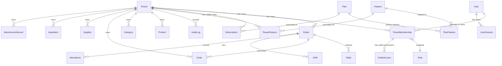

# Multi-Tenant Data & Membership Model

## 1. Domain Entities & Relationships

---

## 2. Core SaaS Models

### 2.1 Tenant
The central sovereign organizational unit.
- `id`: String (UUID v4 or CUID2 - immutable).
- `name`: String (e.g., "Muki Ramen Group").
- `slug`: String (unique URL-friendly slug, e.g., "mukiramen").
- `customDomain`: String? (optional custom domain, e.g., "pos.mukiramen.com").
- `logoUrl`: String?
- `status`: Enum (`TRIAL`, `ACTIVE`, `PAST_DUE`, `GRACE_PERIOD`, `SUSPENDED`, `CANCELLED`).
- `planId`: String (references `Plan`).
- `trialEndsAt`: DateTime?
- `createdAt`: DateTime
- `updatedAt`: DateTime

### 2.2 Outlet (Branch / Store Location)
Physical location operating under a Tenant.
- `id`: String / Int (CUID or autoincrement scoped to tenant).
- `tenantId`: String (references `Tenant.id`).
- `name`: String (e.g., "Outlet Wonomulyo Central").
- `code`: String (e.g., "WNO-01").
- `address`: String?
- `phone`: String?
- `latitude`: Float?
- `longitude`: Float?
- `gpsRadiusMeters`: Float (default 100).
- `status`: Enum (`ACTIVE`, `INACTIVE`, `CLOSED`).
- `settings`: JSON? (outlet-specific hardware configs, printers, receipt footer).
- Constraints: `@@unique([tenantId, code])`, `@@index([tenantId])`.

### 2.3 User & Tenant Membership
Decoupled multi-tenant user identity model:
- `User`: Global authentication identity (`id`, `email`, `phone`, `passwordHash`, `name`, `status`, `isPlatformAdmin`, `createdAt`).
- `TenantMembership`: Multi-tenant link table:
  - `id`: String / Int
  - `userId`: Int (references `User.id`)
  - `tenantId`: String (references `Tenant.id`)
  - `roleId`: String (references `Role.id`)
  - `pin`: String (4-8 digit quick PIN for POS switching within this tenant)
  - `employmentType`: Enum (`FULL_TIME`, `PART_TIME`, `DAILY_WORKER`)
  - `status`: Enum (`ACTIVE`, `INVITED`, `SUSPENDED`, `TERMINATED`)
  - Constraints: `@@unique([userId, tenantId])`, `@@index([tenantId])`, `@@index([userId])`.

### 2.4 Role, Permission & RBAC
- `Role`:
  - `id`: String
  - `tenantId`: String? (NULL for platform system default roles: `OWNER`, `ADMIN`, `CASHIER`, `KITCHEN`, `WAREHOUSE`, `HR`; Non-NULL for custom tenant roles).
  - `name`: String
  - `isSystem`: Boolean (system roles cannot be modified or deleted).
- `Permission`:
  - `id`: String
  - `key`: String (e.g., `pos.create`, `pos.refund`, `inventory.manage`, `reports.view`, `payroll.manage`).
  - `module`: String (e.g., `POS`, `INVENTORY`, `HR`, `FINANCE`).
  - `description`: String
- `RolePermission`:
  - `roleId`: String
  - `permissionId`: String
  - Constraints: `@@id([roleId, permissionId])`.

---

## 3. Table Categorization Matrix

| Table Category | Tables | Multi-Tenancy Strategy |
| :--- | :--- | :--- |
| **Global / Platform** | `PlatformAdmin`, `Plan`, `Feature`, `PlanFeature`, `SystemConfig` | No `tenantId`. Accessible only by platform admins or read-only by feature engine. |
| **Identity & Membership** | `User`, `Tenant`, `TenantMembership`, `Role`, `Permission`, `RolePermission`, `UserSession` | Global user identity, tenant-scoped membership & roles. |
| **SaaS Subscription** | `Subscription`, `SubscriptionItem`, `TenantFeature`, `Invoice`, `UsageRecord` | Scoped by `tenantId`. |
| **Tenant Business Data** | `Category`, `Product`, `Supplier`, `Ingredient`, `RecipeItem`, `Customer`, `PointLog`, `PurchaseOrder`, `PurchaseOrderItem`, `Debt`, `DebtPayment`, `LeaveRequest`, `EmployeeLoan`, `OwnerFundTransaction`, `WarehouseInbound`, `WarehouseSale` | Mandatory `tenantId`, indexed composite keys `(tenantId, id)`. |
| **Tenant + Outlet Data** | `Outlet`, `Table`, `Reservation`, `Order`, `OrderItem`, `CashFlow`, `Attendance`, `Shift`, `ShiftHandover`, `KitchenChecklist`, `WarehouseRequisition`, `IngredientLog` | Mandatory `tenantId` + `outletId`, composite indexes `(tenantId, outletId)`. |
